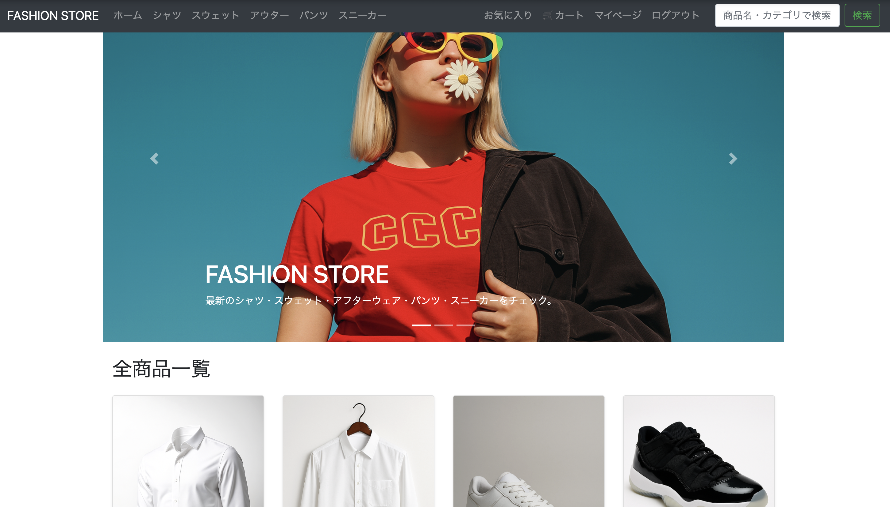

# ファッションサイト　-　さまざまな種類のアイテムを扱う、アパレルブランドの商品を販売するwebサイト

**1.サービス概要**

アパレル商品を扱う会社様向けのwebサイト
_ _ _

**2.サービス画像**

_ _ _

**3.サービスのurl**

_ _ _

**4.サービスの概要**

こちらのwebサイトは、アパレル商品を扱う会社様向けのwebサイトになります。アパレルの商品の一覧と、それぞれのジャンルに沿った商品の一覧を選択できます。

_ _ _

**5.開発背景**

ファッションサイトは、そのサイトがブランドの顔となるという特性があるため、今回の制作を通じて集客という面で何かを学べると思い作成に至りました。
また、アパレルの扱う商材のジャンルは多様にわたる中で、そのようなサイト構成が最も合理的であるかという旨を考えて作成を行いました。

具体的に、ユーザー目線と企業側目線両方の視点が必要な中で、企業目線で、多数の商品をジャンルに分けてユーザーに紹介する必要があるため、タブにおいてジャンル一覧を表示可能になる実装を行いました。また、ユーザー目線では、ホーム一覧においてホバーの機能を実装し、よりユーザーが商品を選択する上で良い機能を実装する旨を考えました。

_ _ _

**6.機能**

ホーム画面
- 商品一覧グリッド  
  - 全カテゴリの商品をカード形式で表示（画像・商品名・価格・カテゴリ）
  - カードをクリックすると商品詳細ページへ遷移
  - 画像ホバー時に、1枚目 → 2枚目の画像に切り替わるエフェクトを実装
- ナビゲーションバー  
  - 「ホーム / シャツ / スウェット / アフター / パンツ / スニーカー」のカテゴリリンク
  - 検索フォーム（キーワード検索）
  - 右側にユーザー関連メニュー（ログイン / 新規登録 / ゲストログイン or マイページ / ログアウト）
  - カートアイコン（カートページへ遷移）
- お問い合わせ導線  
  - 画面下部に「お問い合わせはこちら」ボタンを配置し、問い合わせフォームへ誘導

カート機能

- カートに追加
  - 商品一覧 / 商品詳細ページからカートに商品を追加
- カート画面
  - カート内の商品一覧表示（商品名 / 価格 / 数量など）
  - 合計金額の表示
- ログインユーザーごとにカートを管理

お気に入り機能

- お気に入り登録
  - 商品詳細ページから「お気に入りに追加」ボタンでお気に入りに登録
  - 同じ商品を同じユーザーが重複登録できないようバリデーション
- お気に入り解除
  - すでにお気に入り済みの場合は「お気に入りから外す」ボタンを表示
- お気に入り一覧ページ
  - ログイン中ユーザーのお気に入り商品をカード一覧で表示
  - 各カードから商品詳細ページへ遷移可能

検索機能

- ヘッダーの検索フォームから商品検索
- 商品名 / カテゴリ / 説明文 を対象に部分一致検索
- 検索結果を一覧表示し、商品詳細ページへの導線を提供

ユーザー認証・ゲストログイン

- Devise を利用した認証機能
  - メールアドレス + パスワードでの新規登録 / ログイン / ログアウト
  - パスワードリセット（「パスワードをお忘れの方はこちら」からメール送信）
  - 会員情報編集（メールアドレス / パスワード変更）
- ゲストログイン機能
  - 「ゲストログイン」ボタンから、メールアドレス不要でデモ用ログインが可能
  - ポートフォリオ閲覧者が手軽にカート / お気に入り機能を試せるように設計

_ _ _

**7.主な使用技術**

フロントエンド
- HTML / CSS / JavaScript
- Bootstrap 4.5

バックエンド
- Ruby 3.3.3
- Ruby on Rails 7.2.3
- PostgreSQL

  
開発環境
- Git / GitHub
- Heroku

_ _ _
**8.ER図**

_ _ _

**9.今後の展望**

### 直近の修正予定

- 商品登録・編集・削除（CRUD）の管理機能整備
- UI の細かな見た目調整・デザインの統一

### 　　短期的な目標

- カテゴリ検索・絞り込み機能の拡張（サイズ / 色 / 価格帯など）
- 商品レビュー機能の追加（星評価 / コメント）

###  中長期的な目標

- 管理者用ダッシュボード（売上集計 / 在庫管理 / アクセス分析）
- SNS シェア機能の追加（Instagram / X / LINE）
- デザイン面のブラッシュアップ

